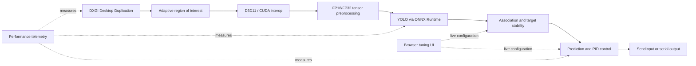

# Delta — Real-Time GPU Vision and Predictive Control

Delta is a Windows-based computer-vision and control project that detects, tracks, and follows head/body targets in live desktop imagery. It began as a Python/Ultralytics prototype and evolved into a modular C++20 runtime designed around low latency, predictable timing, and GPU-resident data flow.

The project is most interesting as a systems-engineering exercise: it combines model training, native screen capture, GPU interoperability, inference optimization, target association, feedback control, multithreading, observability, and hardware-aware input output in one end-to-end application.

> This is an educational research prototype intended for controlled environments. Use it only where automation is permitted and respect the terms of any third-party software.

## What the system does



At runtime, Delta captures a focused desktop region, runs a two-class YOLO detector, maintains a stable target identity, predicts motion, and converts the remaining screen-space error into bounded control commands. The main application also exposes live tuning, diagnostic previews, and stage-level performance telemetry.

## Engineering highlights

### Low-latency native pipeline

- Uses **DXGI Desktop Duplication and D3D11** instead of general-purpose screenshot APIs.
- Crops the requested region on the GPU and supports **D3D11–CUDA interoperability**, avoiding a CPU round trip when capture and inference use the same adapter.
- Runs a custom CUDA kernel that combines resize, BGRA-to-RGB conversion, normalization, and NCHW layout conversion into one operation.
- Supports FP16 and FP32 tensors, persistent GPU buffers, ONNX Runtime I/O binding, TensorRT engine caching, and optional CUDA Graph replay.
- Handles dual-GPU systems explicitly: capture and inference adapters may differ, with an automatic host-memory fallback when zero-copy interoperability is unavailable.

### Freshness-first concurrency

- Separates capture, inference, control, frontend, preview, and overlay responsibilities.
- Passes frames and commands through thread-safe **latest-value slots**. New data replaces stale work instead of allowing an unbounded queue to increase control latency.
- Uses monotonic timestamps throughout the pipeline to measure capture, preprocessing, inference, post-processing, command generation, and end-to-end latency.
- Includes fresh-frame policies, cached-frame handling, and a display-rate servo so the control loop can operate independently of detector cadence without acting on targets that are too old.

### Target tracking and stability

- Scores candidate associations using IoU, spatial distance, confidence, class consistency, current-lock bias, and speed-aware distance gates.
- Uses commit/hold hysteresis, target guards, stable-frame dampening, and lost-frame budgets to reduce target flicker and accidental switching.
- Supports adaptive capture focus and crop sizing: the search region grows when a target is lost and contracts around a stable target to preserve useful detector resolution.
- Provides optional Kalman prediction, velocity/acceleration smoothing, target leading, and ego-motion compensation.

### Predictive feedback control

- Implements raw, velocity-assisted, legacy PID, and predictive PID strategies behind a common runtime configuration.
- The predictive controller fuses current error with estimated velocity, acceleration, and measured pipeline latency.
- Includes integral anti-windup, derivative/output limiting, startup ramping, reversal gating, settle detection, and size-aware dead-zone hysteresis.
- Keeps fractional output remainders and splits large movements into bounded steps, preventing quantization loss at low speeds while respecting backend limits.

### Runtime tuning and diagnostics

- Serves a dependency-light local HTTP/JSON interface at `http://127.0.0.1:8765/` for live parameter tuning and status inspection.
- Provides D3D11/ImGui diagnostic windows for detections, target state, controller output, and timing data.
- Emits periodic `[PERF]` snapshots for capture FPS, inference FPS, control rate, per-stage duration, and end-to-end latency.
- Supports both Win32 `SendInput` and a high-baud serial protocol, with an RP2040 sample host included for hardware experiments.

## Technology stack

| Area | Technologies |
| --- | --- |
| Native runtime | C++20, CMake 3.25+, MSVC, Win32 API |
| Capture and rendering | DXGI Desktop Duplication, Direct3D 11, Dear ImGui |
| GPU acceleration | CUDA C++, D3D11/CUDA interop, CUDA streams/events, CUDA Graphs |
| Inference | YOLO, ONNX, ONNX Runtime, CUDA Execution Provider, TensorRT, FP16 |
| Training and experimentation | Python, PyTorch, Ultralytics, OpenCV, NumPy, MSS |
| Control and tracking | PID control, kinematic prediction, Kalman filtering, IoU-based association, EMA smoothing |
| Runtime interface | Embedded HTTP server, JSON API, HTML/CSS/JavaScript |
| Output | Win32 `SendInput`, serial CDC, RP2040/Arduino |
| Data workflow | Roboflow export, YOLO-format annotations, train/validation/test split |

## Model workflow

The detector is trained in [train.py](train.py) with Ultralytics and PyTorch. The current configuration uses a YOLO26m checkpoint, 640 × 640 inputs, a 150-epoch schedule, early stopping, warmup, SGD-style momentum/weight decay, and an increased box-loss weight for small-target localization.

The dataset configuration in [data.yaml](data.yaml) describes 9,600 Roboflow-exported images under a CC BY 4.0 license. Its two numeric model classes are interpreted by the runtime as:

| Class | Runtime meaning |
| --- | --- |
| `0` | Body target |
| `1` | Head target |

[genOnnx.py](genOnnx.py) exports the selected checkpoint as a fixed-shape, simplified ONNX graph with integrated NMS and optional FP16 weights. [build_trt_cache.py](build_trt_cache.py) warms the inference backend so TensorRT can build and cache its optimized engine before latency-sensitive runs.

## Repository layout

```text
Delta/
├── cpp_port/                  # Primary C++20 implementation
│   ├── include/delta/         # Interfaces, shared types, and configuration
│   ├── src/                   # Capture, inference, tracking, control, and UI
│   ├── sample_usb_host/       # RP2040 serial-output example
│   ├── docs/migration_plan.md # Python-to-C++ design and migration notes
│   └── README.md              # Detailed native runtime documentation
├── train.py                   # YOLO training entry point
├── genOnnx.py                 # PyTorch checkpoint to ONNX export
├── data.yaml                  # Dataset locations and class definitions
├── *Kalman*.py                # Kalman/prediction experiments
├── *NonKal*.py                # Non-Kalman control experiments
└── runs/.../best.onnx         # Versioned inference artifact
```

The Python scripts preserve the experimentation history and behavioral baselines. The production-oriented architecture lives under [`cpp_port`](cpp_port/README.md), where major capabilities are split into focused modules such as `capture`, `inference`, `tracking`, `predictive_pid`, `target_association`, `control`, and `frontend`.

## Build and run

### Prerequisites

- Windows 10 or 11
- Visual Studio 2022 with Desktop development with C++
- CMake 3.25 or newer
- Python 3 with `onnxruntime` or `onnxruntime-gpu` (the native runtime can discover DLLs from the installed wheel)
- For the accelerated path: an NVIDIA GPU, CUDA Toolkit with Visual Studio integration, and optionally TensorRT

### 1. Build the portable native path

From a Developer PowerShell:

```powershell
cd cpp_port
cmake --preset vs2022-x64
cmake --build --preset delta-native-release
```

### 2. Point the runtime to the model

From `cpp_port`, configure the included ONNX artifact and choose a provider. CPU is the simplest smoke-test path:

```powershell
$env:DELTA_MODEL_PATH = (Resolve-Path "..\runs\detect\train\weights\best.onnx")
$env:DELTA_ONNX_PROVIDER = "cpu"
$env:DELTA_ONNX_REQUIRE_GPU = "0"
```

For NVIDIA inference, install the compatible ONNX Runtime GPU/CUDA dependencies and use `cuda` or `tensorrt` instead.

### 3. Run

```powershell
.\build\vs2022-x64\Release\delta_native.exe
```

Open `http://127.0.0.1:8765/` to inspect status and tune the controller while it is running. Press `Insert` to stop the application.

### Full CUDA capture path

```powershell
cd cpp_port
cmake --preset vs2022-cuda-probe
cmake --build --preset delta-native-cuda-release

$env:DELTA_MODEL_PATH = (Resolve-Path "..\runs\detect\train\weights\best.onnx")
$env:DELTA_ONNX_PROVIDER = "cuda"  # or "tensorrt"
.\build\vs2022-cuda-probe\Release\delta_native.exe
```

The native runtime resolves provider assets from environment variables, its local runtime folders, or a Python ONNX Runtime installation. See the [C++ runtime guide](cpp_port/README.md) for the complete DLL layout, environment variables, hotkeys, serial packet format, and CUDA interoperability probe.

## Verification approach

The native design keeps the mathematical and stateful parts independent from capture and inference so they can be exercised deterministically. The local CMake test suite covers recoil profiles, virtual aim offsets, raw tracking, predictive PID behavior, sigma drift, adaptive capture focus, target association and guarding, target lead, trigger gating, output suppression, control encoding, and detection dampening.

For integrated performance checks, the application records stage-level timings rather than relying on a single FPS value. This makes it possible to distinguish capture stalls, preprocessing cost, provider execution time, post-processing cost, and stale-frame latency.

## Key design tradeoffs

- **Windows-specific by design:** DXGI, D3D11, and Win32 input provide the required native integration but limit portability.
- **Freshness over throughput:** dropping superseded frames may reduce the number of processed frames, but prevents queueing delay from making control decisions stale.
- **GPU fast path with graceful fallback:** same-adapter capture enables the best path; multi-adapter systems remain functional through host memory.
- **Runtime tunability over minimal surface area:** the controller exposes many parameters because target motion, frame cadence, and output hardware change the ideal response.
- **CPU post-processing remains:** capture, preprocessing, and inference can stay GPU-resident, while output decoding and NMS are currently CPU-side.

## Further reading

- [Native runtime guide](cpp_port/README.md)
- [Python-to-C++ migration plan](cpp_port/docs/migration_plan.md)
- [Core runtime configuration](cpp_port/include/delta/config.hpp)
- [Predictive PID interface](cpp_port/include/delta/predictive_pid.hpp)
- [Target association interface](cpp_port/include/delta/target_association.hpp)
